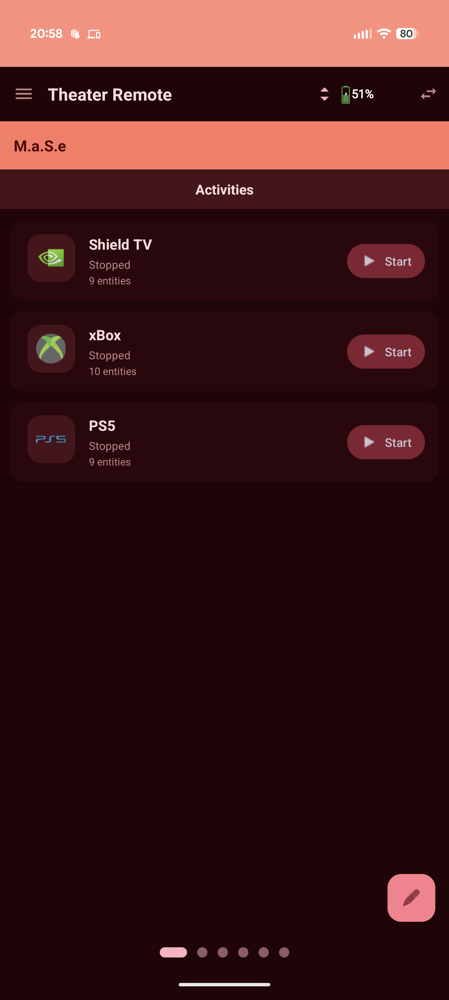
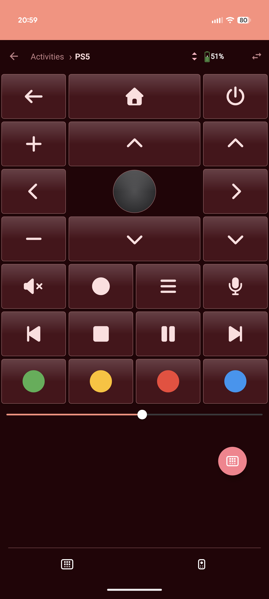
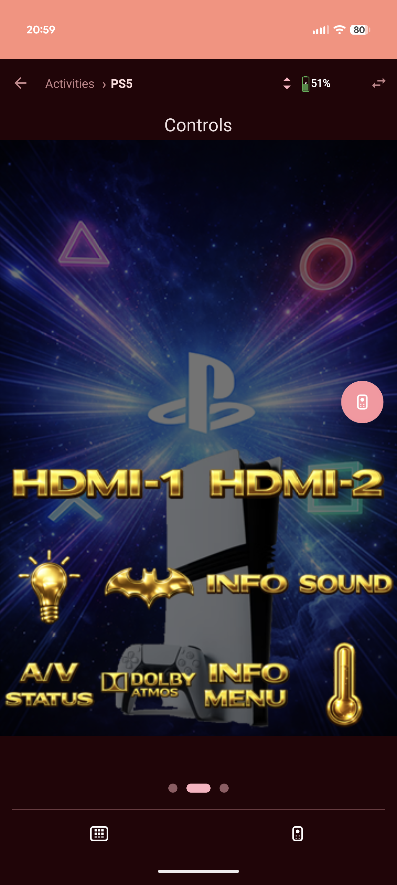
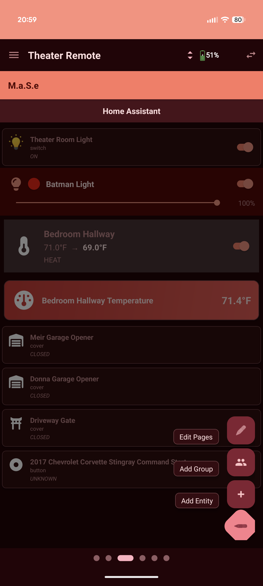
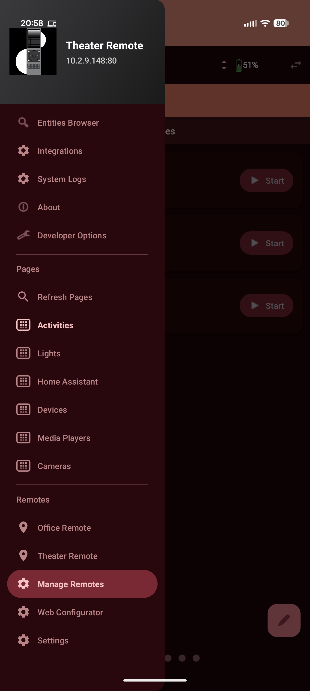
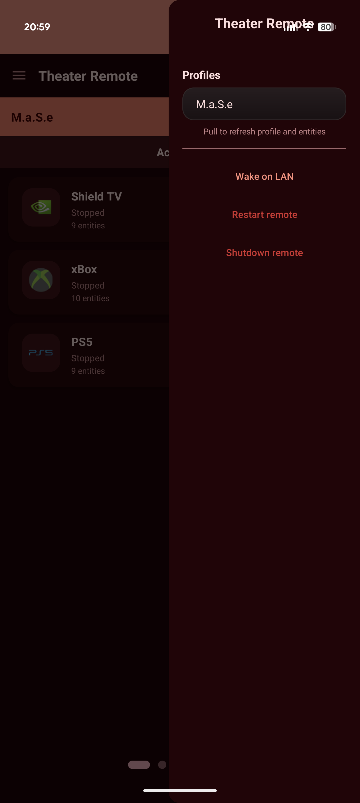
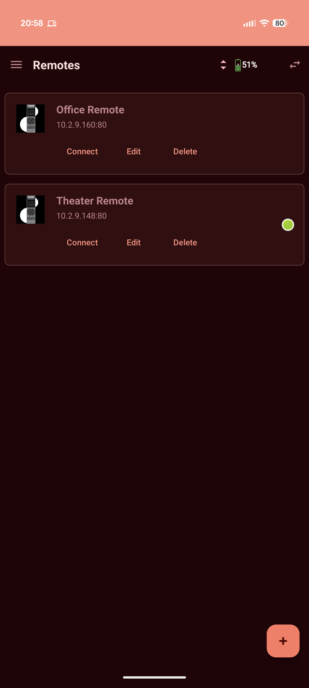
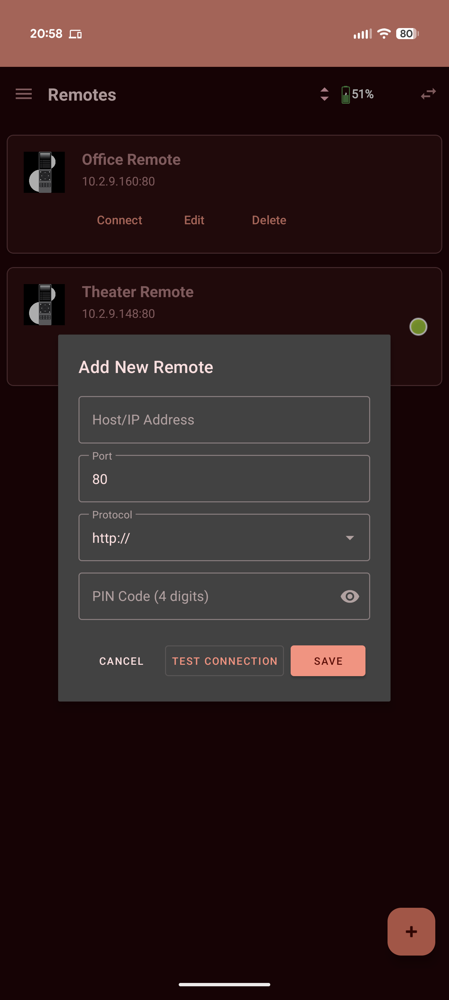

# UC Remote Android - Native Control for Unfolded Circle Remote 2/3

**Complete, native Android control for your Unfolded Circle Remote 2/3 devices**

[Features](#-features) • [Screenshots](#-screenshots) • [Installation](#-installation) • [Support](#-support-development)

---

## 🌟 Overview

UC Remote Android is a fully-featured native Android companion app for Unfolded Circle Remote 2 and Remote 3 devices. Built with 100% Kotlin, it provides comprehensive entity management, real-time WebSocket updates, custom UI pages, complete profile support, and production-grade reliability with Firebase Crashlytics integration.

### Why UC Remote Android?

- 🎯 **Complete Feature Parity** - All iOS app features, natively on Android
- ⚡ **Real-Time Updates** - WebSocket-based instant entity state synchronization
- 🎨 **Beautiful UI** - Material Design 3 with iOS-inspired glass effects
- 🔄 **Auto-Recovery** - Unlimited WebSocket reconnection with exponential backoff
- 🛡️ **Production Ready** - Firebase Crashlytics for stability monitoring
- 📱 **Universal** - Phones, tablets, and foldables fully supported

---

## ❤️ Support Development

This app and all my integrations represent hundreds of hours of development and dedication. If you find this app useful, please consider supporting continued development:

*Your support helps maintain this app and fund continued development. Thank you!* ❤️

---

## 🎯 Features

### 📱 Device Management

#### **Multi-Remote Support**
- Connect to unlimited UC Remote 2/3 devices simultaneously
- Quick remote switching with live connection status
- Per-remote profile and entity management
- Automatic connection persistence across app restarts

#### **Advanced Authentication**
- **Token-Based Security** - Secure PIN authentication with automatic token management
- **Auto-Recovery System** - Automatic re-authentication after device reboots
- **Fallback Authentication** - Bearer to Basic auth automatic fallback
- **Encrypted Storage** - Secure credential and token storage
- **Session Persistence** - Maintains authentication across app sessions

#### **Connection Management**
- **Unlimited Reconnection** - WebSocket auto-reconnect with exponential backoff
- **Network Resilience** - Automatic connection recovery after network changes
- **Connection Monitoring** - Real-time connection state with visual indicators
- **Wake-on-LAN Support** - Wake sleeping remote devices from the app

### 🎮 Entity Control

#### **Media Players**
- **Full Playback Control** - Play, pause, stop, skip (previous/next)
- **Advanced Seeking** - Custom seek bar with configurable time ranges (up to 80%)
- **Volume Management** - Slider control with configurable range (up to 100%)
- **Album Art Display** - Full-resolution artwork with tap-to-play/pause
- **Media Information** - Title, artist, album, duration, and position
- **Source Selection** - Input source switching with visual feedback
- **Shuffle & Repeat** - Toggle playback modes
- **State Synchronization** - Real-time WebSocket state updates

#### **Lights**
- **Power Control** - On/Off toggle with instant feedback
- **Brightness Control** - Smooth 0-100% slider adjustment
- **Color Temperature** - Warm to cool white adjustment
- **Full RGB Control** - Color wheel picker with hue/saturation
- **Color Presets** - Quick access to common colors
- **Real-Time Updates** - WebSocket-synced state changes

#### **Climate Control**
- **Temperature Adjustment** - Precise target temperature control
- **Mode Selection** - Heat, cool, auto, dry, fan-only, off
- **Fan Speed Control** - Low, medium, high, auto settings
- **Current State Display** - Real-time temperature and humidity
- **HVAC Actions** - Turn on/off, set temperature, change mode
- **Visual Feedback** - Color-coded mode indicators

#### **Covers/Blinds**
- **Position Control** - Open, close, stop commands
- **Precise Positioning** - 0-100% position slider
- **Tilt Adjustment** - Blind angle control (where supported)
- **State Feedback** - Real-time position updates
- **Multiple Cover Support** - Control multiple covers simultaneously

#### **Switches & Buttons**
- **Switch Toggle** - On/Off control with state persistence
- **Button Actions** - Single press command execution
- **State Indicators** - Visual on/off state display
- **Custom Commands** - Execute any configured entity command
- **Haptic Feedback** - Tactile confirmation on press

#### **Remote Entities** ⭐ *NEW*
- **IR/RF Control** - Send infrared and radio frequency commands
- **Button Grid Display** - Visual remote control layout
- **Custom Button Mapping** - User-defined button configurations
- **Command Execution** - Instant command transmission
- **Activity Integration** - Remote buttons within activity pages
- **Haptic Feedback** - Button press confirmation

#### **Sensors** ⭐ *NEW*
- **Comprehensive Support** - Temperature, humidity, battery, motion, binary sensors
- **Nested Data Parsing** - Support for complex sensor data structures
- **Unit Display** - Automatic unit formatting (°C, °F, %, lux, etc.)
- **State Monitoring** - Real-time sensor value updates
- **Icon Integration** - Custom sensor icons from FontAwesome and UC Icons
- **Attribute Display** - Additional sensor attributes and metadata

### 🎯 Activities

#### **Activity Management**
- **Start/Stop Control** - Launch and terminate activities instantly
- **Running State Display** - Visual indicators for active activities
- **Activity Sequences** - Multi-step entity control workflows
- **Custom Pages** - Activity-specific UI page configurations
- **Quick Access** - Dedicated activities list with search

#### **Activity Pages** ⭐ *ENHANCED*
- **Media Integration** - Now playing display with album art
- **Remote Integration** - Full remote entity support within activities
- **Entity Groups** - Organized control of activity entities
- **Custom Layouts** - User-defined page arrangements
- **Tab Navigation** - Interface/Buttons tab switching
- **Gesture Support** - Swipe navigation between activity pages

### 🎨 UI Pages System

#### **Custom Page Management**
- **Unlimited Pages** - Create as many custom pages as needed
- **Page Operations** - Add, remove, rename, reorder with drag-drop
- **Auto Grid Layout** ⭐ *NEW* - Automatic button arrangement based on screen size
- **Responsive Design** - Adapts to phones (3 columns) and tablets (4-6 columns)
- **Page Persistence** - Saves all configurations locally and syncs to Remote
- **Page Indicators** - Animated dot indicators with smooth transitions

#### **Entity Buttons**
- **Entity Linking** - Connect any entity type to buttons
- **Custom Icons** - Support for Material, FontAwesome Pro, and UC Icons
- **FontAwesome Pro Fallback** ⭐ *NEW* - Readable text for missing Pro icons
- **Icon Customization** - Change icons per button
- **Button Labels** - Customizable text display
- **State Colors** - Visual entity state feedback
- **Tap Actions** - Single tap to control entities

#### **Icon System** ⭐ *ENHANCED*
- **FontAwesome Pro Support** - Full FA Pro icon set with text fallback
- **UC Icons** - Native Unfolded Circle icon font
- **Material Icons** - Android Material Design icons
- **TV Channel Icons** - Support for "ctv:" prefix channel icons
- **Fallback Handling** - Displays readable text for unavailable icons
- **Icon Loading** - Efficient caching and loading system

### 👤 Profile System

#### **Multi-Profile Support**
- **Unlimited Profiles** - Support for all profiles on Remote device
- **Quick Switching** - Instant profile change with right drawer
- **Profile Sync** - Automatic synchronization with Remote device
- **Entity Filtering** - Profile-specific entity visibility
- **Per-Profile Pages** - Custom page configurations per profile
- **Active Profile Display** - Visual indicator of current profile

#### **Profile Pages**
- **Activity Pages** - Dedicated activity control and monitoring
- **Media Player Pages** - Media-focused layouts and controls
- **Custom Groups** - User-defined entity collections
- **Group Editor** - Visual group creation and management
- **Page Templates** - Quick setup with predefined layouts
- **Export/Import** - Share profile configurations

### 🔄 Real-Time Updates & Reliability

#### **WebSocket Integration**
- **Live State Updates** - <100ms entity state synchronization
- **Unlimited Reconnection** ⭐ *NEW* - Auto-reconnect with exponential backoff
- **Connection Recovery** - Automatic recovery after network interruptions
- **State Synchronization** - All entities stay perfectly in sync
- **Low Latency** - Optimized WebSocket communication
- **Connection Status** - Visual feedback of WebSocket state

#### **Production Reliability** ⭐ *NEW*
- **Firebase Crashlytics** - Crash reporting and analytics
- **Error Recovery** - Graceful handling of network/API errors
- **Memory Management** - Optimized lifecycle with repeatOnLifecycle
- **Connection Pooling** - Proper OkHttp connection management
- **Background Resilience** - Maintains connections during app backgrounding

### 🌐 System Management

#### **Integrations**
- **Integration Browser** - View all configured integrations
- **Device Management** - See integration-managed devices
- **Driver Information** - Integration driver details and versions
- **Connection Monitoring** - Integration health and status
- **Configuration Access** - Quick access to integration settings
- **Search & Filter** - Find integrations and devices quickly

#### **System Logs**
- **Real-Time Viewer** - Live system log streaming
- **Log Filtering** - Filter by level (debug, info, warning, error)
- **Search Logs** - Text search within log entries
- **Export Logs** - Share logs for troubleshooting
- **Timestamps** - Precise log entry timing
- **Auto-Scroll** - Follow latest log entries

### 🎭 User Interface

#### **Material Design 3**
- **Modern Components** - Latest Material Design 3 components
- **iOS-Inspired Effects** - Polished glass-morphism backgrounds
- **Smooth Animations** - 60fps transitions and interactions
- **Responsive Layout** - Adapts to all screen sizes and orientations
- **Haptic Feedback** - Tactile confirmation for all interactions
- **Custom Components** - D-Pad, touchpad, seekbar, color picker

#### **Theme Support**
- **Light Theme** - Clean, bright interface
- **Dark Theme** - True OLED-friendly dark mode
- **System Theme** - Automatically follow system settings
- **Dynamic Colors** - Entity-based color accents
- **Glass Effects** - Semi-transparent backgrounds with blur
- **Gradient Backgrounds** - Smooth color transitions

#### **Navigation**
- **Left Drawer** - Main navigation menu with all sections
- **Right Drawer** - Profile selector with quick actions
- **Bottom Navigation** - Interface/Buttons tab switching
- **Page Indicators** - Animated page position display
- **Status Bar** - Remote info, battery level, connection state
- **Search** - Global entity and integration search

### 📊 Device Support

#### **Screen Sizes & Layouts**
- **Phones (5-7")** - Optimized 3-column grid layouts
- **Small Tablets (7-9")** - 4-column responsive grids
- **Tablets (10"+)** - 5-6 column layouts with spacing
- **Foldables** - Adaptive layouts for folded/unfolded states
- **Portrait & Landscape** - Full orientation support
- **Auto Grid Adjustment** ⭐ *NEW* - Dynamic column calculation

#### **Android Versions**
- **Minimum SDK** - Android 8.0 Oreo (API 26)
- **Target SDK** - Android 14 (API 34)
- **Tested Versions** - Android 8.0 through Android 14+
- **Material You** - Dynamic theming on Android 12+
- **Permission Handling** - Runtime permissions for network and storage

---

## 📸 Screenshots

### Activities & Remote Control

  
  
  

*Activities list showing running states, native remote control interface (PS5 example), and rich visual backgrounds*

### Entity Browser & Navigation

   
  
  

*Comprehensive entity browser (Home Assistant example), main navigation drawer, and right-side profile selector with quick actions*

### Management & Setup

  
  

*Multi-remote management list and easy connection setup with auto-discovery support*

---

## 🚀 Installation

### Google Play Store

1. Open Google Play Store on your Android device
2. Search for "UC Remote Android"
3. Tap "Install"
4. Launch and connect to your UC Remote device

### Requirements

- **Android Version**: Android 8.0 (Oreo) or higher
- **Network**: WiFi connection (same network as UC Remote)
- **UC Remote**: Remote 2 or Remote 3 with firmware 1.x or higher
- **Permissions**: Network access, Wake-on-LAN (optional)

---

## 🔧 Quick Start Guide

### First Time Setup

1. **Launch the app** - UC Remote Android will open to the Remotes screen
2. **Add your Remote**:
   - Tap the **+** (Add) button
   - Enter your Remote's **IP address** or hostname
   - Enter the **PIN code** (4 digits)
   - Tap **Test Connection**
   - Tap **Save** when connection succeeds

3. **Connect to Remote**:
   - Tap **Connect** on your saved remote
   - Wait for green connection indicator
   - App will load your profiles and entities

4. **Select Profile**:
   - Tap the profile button (top-right)
   - Choose your desired profile
   - Entities will load automatically

### Basic Usage

#### Controlling Entities

**Media Players:**
- Tap album art to play/pause
- Use playback buttons for control
- Drag volume/seek sliders
- Tap source to change input

**Lights:**
- Tap the entity card to toggle on/off
- Use brightness slider
- Tap color picker for RGB control
- Adjust color temperature

**Activities:**
- Tap **Start** to launch activity
- View media playback in activity interface
- Switch between Interface/Buttons tabs
- Tap **Stop** to end activity

#### Using Custom Pages

1. **Navigate to Pages**:
   - Open left drawer menu
   - Select a page category (Activities, Lights, etc.)
   - Swipe horizontally to navigate pages

2. **Add Custom Page**:
   - Open Profile Pages
   - Tap the edit button (✏️ FAB)
   - Tap **Add Page**
   - Name your page
   - Add entity buttons

3. **Customize Buttons**:
   - Long-press any button
   - Select entity to link
   - Choose custom icon
   - Save changes

### Profile Management

1. **Switch Profiles**:
   - Tap profile selector (top-right)
   - Select desired profile from drawer
   - Wait for profile sync (~500ms)
   - New profile loads with entities

2. **Manage Pages**:
   - Navigate to Profile Pages
   - Tap page menu (⋮)
   - Available options:
     - Add new page
     - Rename page
     - Remove page
     - Reorder pages
     - Refresh from Remote

### Remote Management

1. **Manage Remotes**:
   - Tap menu (☰)
   - Select **"Manage Remotes"**
   - Available actions:
     - Add new remote
     - Edit existing remote
     - Remove remote
     - Connect/disconnect

2. **Connection Features**:
   - **Wake-on-LAN**: Wake sleeping remotes
   - **Auto-Reconnect**: Unlimited reconnection attempts
   - **Token Recovery**: Auto re-auth after device reboot

---

## 🔧 Troubleshooting

### Cannot Connect to Remote

**Symptoms:**
- Connection timeout
- "Remote not found" error
- Authentication failed

**Solutions:**
1. Verify Remote is powered on and connected to WiFi
2. Check both devices are on the same network
3. Verify PIN code is correct (4 digits)
4. Try the Remote's IP address instead of hostname
5. Check your router's firewall settings
6. Restart the Remote device
7. Clear app cache: Settings → Apps → UC Remote → Clear Cache

### Entities Not Loading

**Symptoms:**
- Empty entity list
- "Loading..." never completes
- Entities show as "unavailable"

**Solutions:**
1. Pull down to refresh entity list
2. Switch profiles and switch back
3. Tap "Refresh Pages" in profile menu
4. Reconnect to Remote device
5. Verify Remote has integrations configured
6. Check WebSocket connection in System Logs
7. Force close and restart app

### Real-Time Updates Not Working

**Symptoms:**
- Entity states don't update automatically
- Changes on Remote not reflected in app
- Delayed state updates (>5 seconds)

**Solutions:**
1. Check WebSocket connection status (should be green)
2. View System Logs for WebSocket errors
3. Reconnect to Remote device
4. Check network stability (WiFi signal strength)
5. Verify Remote firmware is up to date
6. Restart app to reset WebSocket connection
7. Check if phone's battery saver is limiting background activity

### Profile Switching Fails

**Symptoms:**
- Profile switch timeout
- Entities disappear after switch
- App freezes during profile change

**Solutions:**
1. Wait 5-10 seconds and try again
2. Check WebSocket connection is active
3. Reconnect to Remote device
4. Verify the profile exists on Remote
5. Clear app cache and restart
6. Check network connection stability

### Activity Controls Not Working

**Symptoms:**
- Activity won't start
- Media player not showing in activity
- Remote buttons not responding

**Solutions:**
1. Verify activity is properly configured on Remote
2. Check all activity entities are available
3. Stop and restart the activity
4. Refresh the activity page (pull down)
5. Verify WebSocket connection is active
6. Check activity logs in System Logs section

### Icons Not Displaying

**Symptoms:**
- Missing icons showing as squares
- FontAwesome icons showing text instead
- Custom icons not loading

**Solutions:**
1. This is expected behavior for FontAwesome Pro icons (fallback to text)
2. Clear app cache: Settings → Debug → Clear Cache
3. Refresh pages from Remote
4. Verify icon names in page configuration
5. Check internet connection for first-time icon downloads

### App Crashes or Freezes

**Symptoms:**
- App force closes unexpectedly
- UI becomes unresponsive
- Screen goes black or stuck

**Solutions:**
1. Force stop app: Settings → Apps → UC Remote → Force Stop
2. Clear app cache: Settings → Apps → UC Remote → Clear Cache
3. Update to latest version from Google Play
4. Check Firebase Crashlytics reports (developer)
5. Reinstall app if issues persist
6. Report crash to developer with logs

---

## 🛠️ Technical Details

### Architecture

**Pattern**: MVVM (Model-View-ViewModel)  
**Language**: Kotlin 100% (native Android)  
**UI Framework**: Material Design 3 with custom components  
**Navigation**: Android Navigation Component + Fragment-based architecture  
**State Management**: StateFlow and repeatOnLifecycle for reactive UI  
**Networking**: 
- OkHttp + Retrofit for REST API calls
- OkHttp WebSocket for real-time entity updates
- Proper connection pooling and resource management

**Concurrency**: Kotlin Coroutines with structured concurrency  
**View Binding**: ViewBinding for type-safe view access  
**Persistence**: SharedPreferences with JSON serialization  
**Analytics**: Firebase Crashlytics for production monitoring  
**Memory Management**: Fragment lifecycle with repeatOnLifecycle patterns

### Key Technical Features

- **ViewPager2 Lifecycle Management** - Proper fragment lifecycle handling for page navigation
- **WebSocket State Machine** - Exponential backoff reconnection with unlimited retries
- **Token Authentication** - Automatic token refresh and Bearer/Basic auth fallback
- **Flow Collectors** - Memory-leak-free state collection with repeatOnLifecycle
- **Connection Pooling** - Optimized OkHttp connection management with .use{} blocks
- **Error Recovery** - Graceful handling of network failures and API errors
- **Background Resilience** - Maintains connections during app backgrounding

### API Integration

**UC Remote Core API**:
- REST API for configuration and control
- WebSocket API for real-time state updates
- Token-based authentication with auto-refresh
- Entity management endpoints
- Profile and page synchronization
- Integration and device discovery
- System log streaming

**Supported Entity Types**:
- Media Players (play, pause, stop, seek, volume)
- Lights (on/off, brightness, color, temperature)
- Climate (temperature, mode, fan speed)
- Covers (position, tilt, open, close)
- Switches (on/off toggle)
- Buttons (press commands)
- Sensors (temperature, humidity, battery, binary, etc.)
- Remotes (IR/RF command transmission)
- Activities (multi-entity sequences)

---

## 🔒 Privacy Policy

UC Remote Android is committed to protecting your privacy. The app:

- **No Data Collection**: Does not collect or transmit any personal data
- **Local Storage Only**: All data stored locally on your device
- **No Analytics**: Does not track usage (except crash reports via Crashlytics)
- **No Ads**: Completely ad-free experience
- **Secure Communication**: Direct device-to-device communication only
- **Encrypted Credentials**: Secure storage of authentication tokens

View the complete privacy policy at: [Privacy Policy](https://mase1981.github.io/uc-remote-android/privacy-policy.html)

---

## 📝 License

This project is licensed under the **Mozilla Public License 2.0 (MPL-2.0)**.

This means:
- ✅ Free to use, modify, and distribute
- ✅ Can be used in commercial projects
- ✅ Source code modifications must be disclosed
- ✅ Patent grant included
- ❌ Cannot be relicensed under different terms

See the [LICENSE](LICENSE) file for complete details.

---

## 🤝 Support & Community

### Get Help

- **GitHub Issues**: [Report bugs and request features](https://github.com/mase1981/uc-remote-android/issues)
- **UC Community Forum**: [General discussion and support](https://unfolded.community//)
- **Discord**: [Join UC Discord server](https://discord.gg/zGVYf58)

### Official Links

- **UC Support**: [Official Unfolded Circle Support](https://support.unfoldedcircle.com/)
- **Developer**: [Meir Miyara on LinkedIn](https://www.linkedin.com/in/meirmiyara)
- **iOS Source Reference**: [albaintor's UC Remote iOS](https://github.com/albaintor) - *Special thanks for allowing study of iOS source code*

### Contributing

Contributions are welcome! Here's how you can help:

1. **Report Bugs**: Use GitHub Issues with detailed reproduction steps
2. **Feature Requests**: Suggest new features via GitHub Issues
3. **Beta Testing**: Join the beta program for early access
4. **Spread the Word**: Share with the UC community
5. **Financial Support**: Sponsor via GitHub, BMAC, or PayPal

---

## 🏆 Credits & Thanks

### Development

**Lead Developer**: Meir Miyara  
**Platform**: Native Android (Kotlin)

### Special Thanks

- **albaintor** - For allowing study of iOS app source code and architecture
- **Unfolded Circle** - For the amazing UC Remote hardware and API
- **Beta Testers** - All 31 beta testers who provided invaluable feedback
- **UC Community** - For support, feature requests, and enthusiasm
- **Contributors** - Everyone who reported bugs and suggested improvements

### Built With

- Android Studio & Kotlin
- Material Design 3 Components
- OkHttp & Retrofit
- Kotlin Coroutines & Flow
- Firebase Crashlytics
- ViewPager2 & Navigation Component
- FontAwesome & UC Icons

---

**Made with ❤️ for the Unfolded Circle Community**

*UC Remote Android - Your Remote, Your Phone, Your Control*

[⬆ Back to Top](#uc-remote-android---native-control-for-unfolded-circle-remote-23)

